# Clearance Tool

This application serves as a centralized platform for assigning and managing clearances, specifically door accesses. Users are either a Liaison or an Admin. Admin users have full access with all features described below. Liaisons are given permissions to assign or revoke certain clearances to anyone they'd like, and to view reports regarding clearances under their jurisdiction.

## Admin

A user with the Admin role is granted administrative privileges and is authorized to perform the following activities:

- **Assign Clearances**: View, assign, or revoke clearances for users.
- **Scheduled Actions**: View any Scheduled Actions they've made.
- **Reports**: A Liaison tool to view activity with certain clearances.
- **Liaison Permissions**: View and update the list of clearances that a Liaison user is authorized to assign to other users.
- **Audit Log**: View the chronological sequence of activities performed by all users.
- **Admin** View and manage every user who has access to the tool.

&nbsp;

 

### Assign and Manage Clearances

#### Assignments & Revocations:

Type the UnityID or email address into the "Select Person" field and choose the desired person from the dropdown menu below. Once you have selected a "Person", a "Select Clearance" field will appear below it, followed by a list of the clearances that are available to the user. Please note that you have the option to select multiple users at this step.

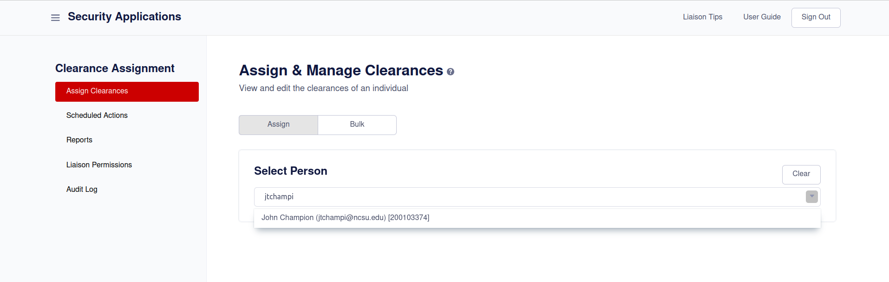

After selecting a person, their clearances will be displayed below. You can choose to revoke any of those clearances immediately or to revoke a clearance at a later date.

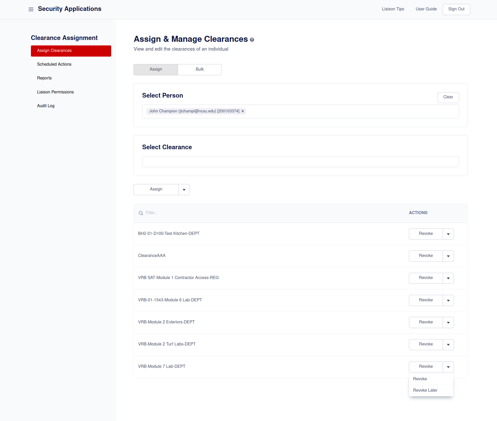

Enter the desired clearance in the "Select Clearance" field, and then click on the appropriate option from the filtered list of available clearances. Please keep in mind that you can select multiple clearances, and all of them will be applied to the users selected in the previous step.

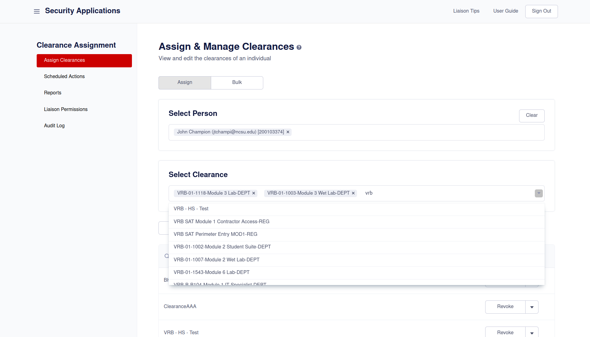

To complete the clearance assignment for the user/users, simply click on the "Assign" button. Once the clearance has been successfully assigned, it will appear in the list with a success message.

Optionally, you can schedule a clearance to be assigned on a future date by selecting "Assign Later" in the split button. When this option is selected, a date picker will appear, allowing for the selection of a date for the action to take place. Select the desired date, then click "Assign Later".

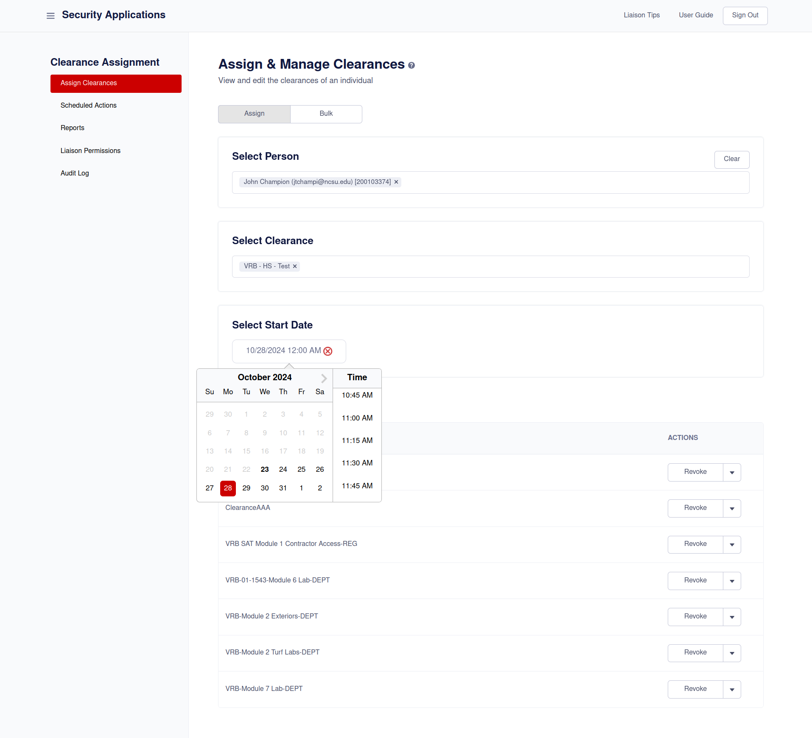

#### Bulk Actions:

You can make as many clearance assignments and revocations as you'd like in one step with Bulk Actions. With this, upload a CSV file with the assignments and revocations you'd like to make, and they will be done.

Click the `Bulk` button at the top of the page to upload a CSV file with as many action as you'd like. Click the `Download Template` button to see an example of a valid CSV file.

Upload a CSV file by dragging the file onto the arrow or by clicking `Browse`.

Review your actions, then click `Submit Actions`.

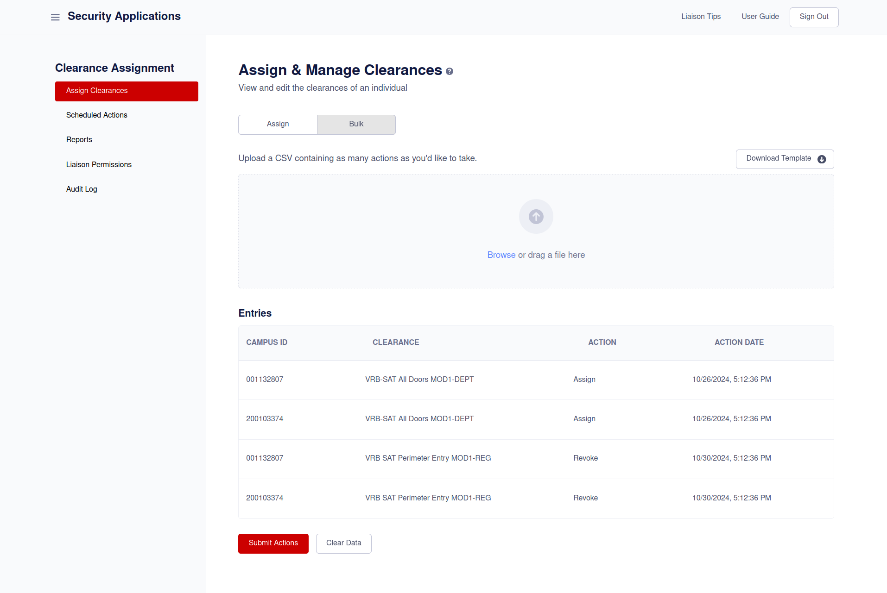

If there are errors in your file, you'll need to upload a different file with those errors resolved.

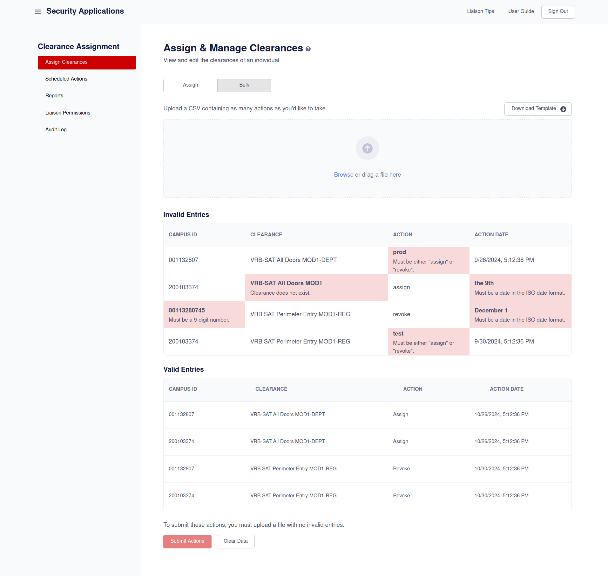

#### Notes On Each Row

- The Clearance Name is case-sensitive, must be an exact match, and must exist.
- The Action must be either "assign" or "revoke".
- The date must be in the ISO format. You can learn more about that format [here](https://www.digi.com/resources/documentation/digidocs/90001488-13/reference/r_iso_8601_date_format.htm).

&nbsp;

### Scheduled Actions

You can see any the status of any assignent or revocation that you scheduled. These are listed in cronological order, and you can filter these actions to narrow down the set of results.

You can see the status of each action - whether it is still pending for a future date, or whether or not it succeeded or failed. If an action failed, you can hover your cursor over the status icon of that row to see why it failed.

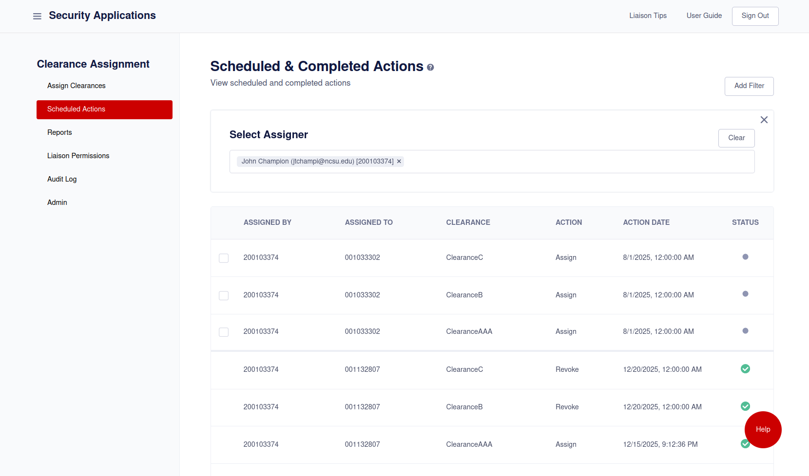

#### Cancelling a Scheduled Action

You can cancel any pending actions by selecting any actions you would like to cancel, then clicking the red "Cancel Scheduled Actions" button at the top right of the view. Only pending actions can be cancelled.

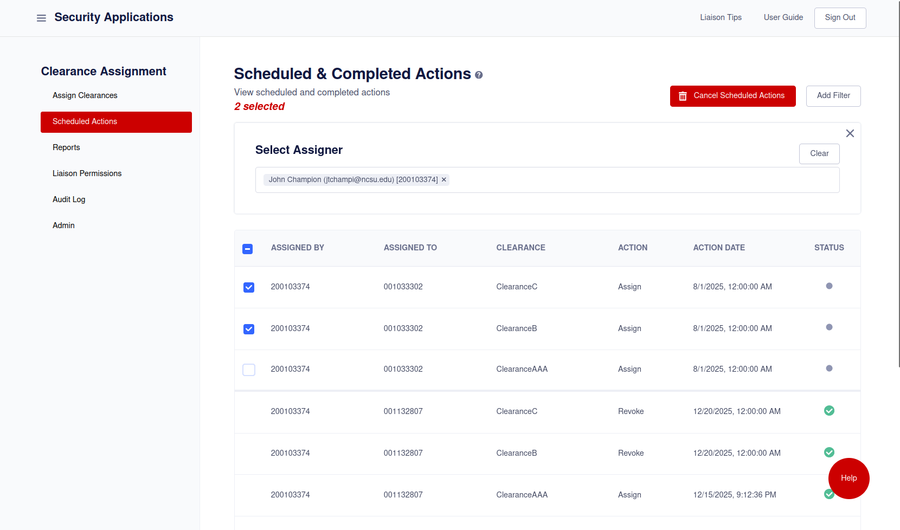

&nbsp;

### Reports

Reports are clear lists of information about the assignable clearances. Reports include doors for each clearance, persons assigned to each clearance, and a history of badge transactions for each person. Transactions reports are only available to admins.

The total assignments from all liaisons by month can be downloaded as a CSV by clicking the button on the far right labeled "Liaison Assignments".

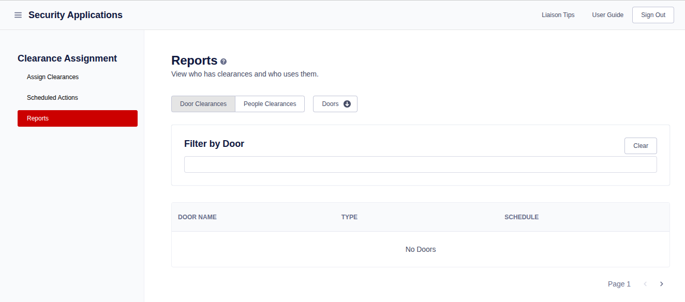

#### Door Clearances

Door Clearances include a list of all clearances in your jurisdiction to assign and the doors tied to those clearances. A list of those clearances is shown, paginated. Under each clearance, three or less doors will be shown. To view all doors, expand the clearance, and all doors will be shown for that clearance. Each door record includes the name of the door, whether or not it is a door or an elevator, and the schedule of the door.

#### People Clearances

All persons who have each clearance will be displayed for each clearance that is allowed to be assigned. Much like Door Clearances, a paginated list of all clearances is shown, and under each clearance, three or less persons will be displayed. Expand the clearance to view everyone who has that clearance. Each person includes a first name, last name, email address, and status. The report can optionally be filtered by person to view each clearance that person has.

#### Transactions

Transactions display a log of each event on each door. Events include whenever someone badges into a door ("Admit") or whenever an unauthorized person tries to badge in ("Reject").

- The Primary and Secondary Objects represent the door and the person badging into the door.
- The Prox ID is the unique ID for the card.
- The State is what happened in that interaction. This will be either Admit or Reject - an authorized person badged in or an unauthorized person tried to badge in.

&nbsp;

### Liaison Permissions

Liaisons can only assign or revoke clearances of which they have permission. The Liaison Permissions page is where that is set up.

**Note**: Giving clearance permissions to Liaisons and giving access to the tool are seperate. If you give a permission to a Liaison, that does not necessarily mean they have access to the tool.

**Note**: For a Liaison to log into the tool, access must be given using their email address. If access is given to an alias email address, the user will not be able to log in.

#### Assigning Permissions to Liaisons:

**Step 1**: Select a person from the input field by typing an email address. A list of their clearance permissions will be displayed. Please note that only one user can be selected at a time in this section. Make sure that anyone who is selected has an email address.

**Step 2**: Enter the clearances you'd like for them to be able to assign. You can select one or more clearances to be given.

**Step 3**: Click the "Give Permission" button. Once the clearance has been successfully assigned, it will appear in the list with a success message. Please note that if any of the selections made above are incorrect, the button may not be activated.

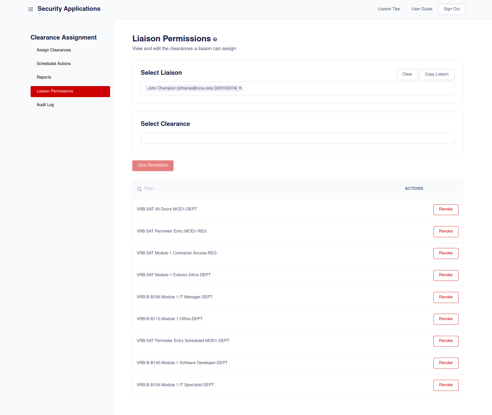

#### Copying Liason Permissions to Another Liaison:

You can copy all of one Liaison's clearance permissions to another by copying their permissions.

**Step 1**: Select a person from the input field by typing an email address. All of the clearances that appear for this person will be copied to another individual.

**Step 2**: Click the "Copy Liaison" inside of the liaison picker card.

**Step 3**: In the Dialog box that appears, select another person for which the clearance permissions will be copied.

**Step 4**: Click the red "Copy Liaison" button to finish.

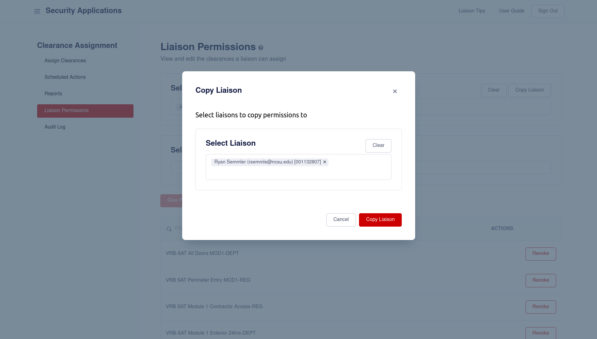

&nbsp;

### Audit Log

The "Audit Log" screen serves as a comprehensive record of all clearance assignments performed by any Admin user. It maintains a detailed log of every instance where clearances have been assigned or revoked. This screen allows users to track and review the history of clearance assignments and revokations made within the system. Every record includes the following information:

"**DATE ASSIGNED**": This column displays the date and time when the assignment or revocation took place.

"**ACTION**": In this column, you will find the name of the clearance followed by the verb "assigned" or "revoked", indicating the action that occurred.

"**ASSIGNED TO**": This column contains the name of the individual to whom the clearance was either assigned or revoked.

"**DONE BY**": The user who performed the operation is identified in this column by their name.

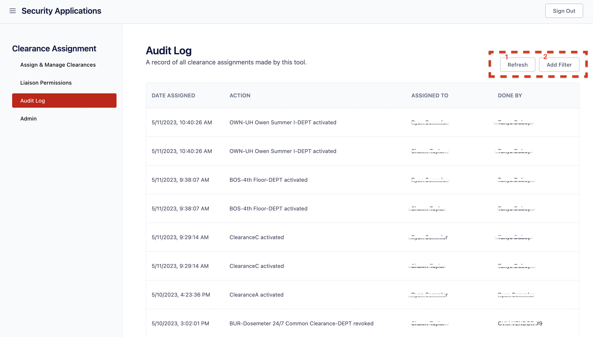

[1] The refresh button at top right retrieves the latest entries.
[2] The filter button enables the user to apply predefined filters for refining the logs based on specific criteria.

To retrieve the next set of logs, scroll to the bottom of the screen and click the "load more" button.

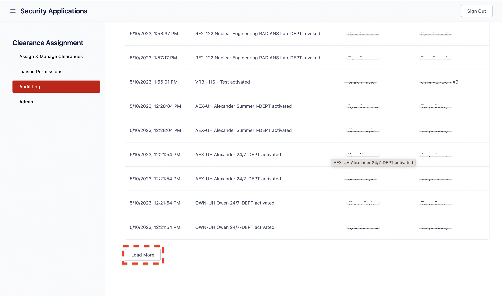

There are four types of filters available for refining the logs. The filters are listed as follows:

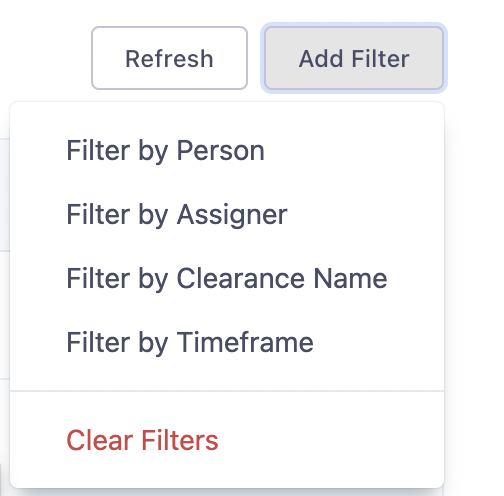{: style="height:250px;width:250px; display: block ;margin-left:auto;margin-right: auto;"}

"**Filter by Person**": To filter by the name of the individual receiving the assignment, select "Filter by Person" and enter the UnityID or email address in the "Select Person" field. From the drop-down menu below, select the desired person. This will refine the displayed results based on the selected individual's involvement in the assignments.

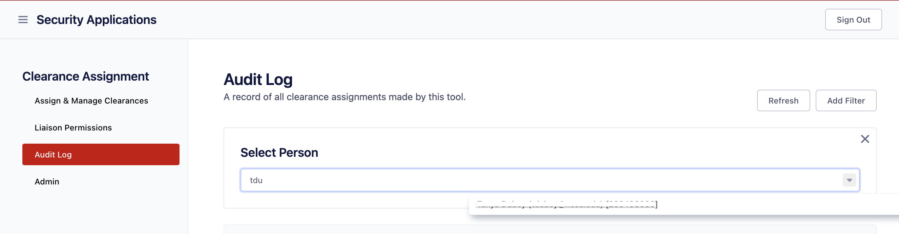

"**Filter by Assigner**": To filter by the user/Liaison who performed the operation, select "Filter by Assigner" and enter the UnityID or email address in the "Select Person" field and select the desired person from the list.

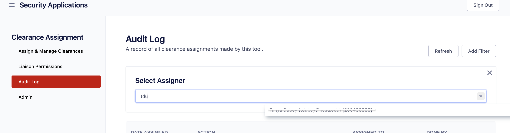

"**Filter by Clearance Name**": To apply the "Filter by Clearance Name" option, start by entering a clearance name in the search clearance field. Next, select the desired clearance from the list. By performing these steps, all the logs associated with the chosen clearance will be shown in the resulting view.

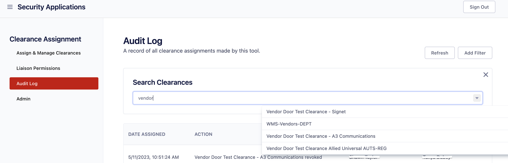

"**Filter by Timeframe**": The "Filter by Timeframe" option allows you to refine the displayed logs based on a specific time range. By selecting this filter, you can define a starting and ending time to narrow down the logs within that timeframe.

By default, the "Start" and "End" are not selected, resulting in the display of all logs in the list. To specify a "Start" date and time, click on the first circle. A calendar view will appear, allowing you to choose the desired date. Scroll vertically in the time column to select the desired time. Repeat the same process for the "End" date and time by clicking on the second circle.

This feature is useful for focusing on a particular period of interest, such as logs generated within the last day, week, month, or any custom timeframe.

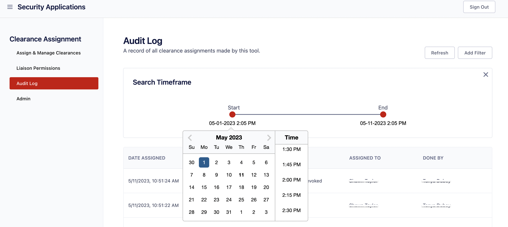

It is possible to apply more than one filter simultaneously to obtain further refined results. However, please note that a maximum of three filters can be applied, with the limitation that you can choose either "**Filter by Person**" or "**Filter by Assigner**", not both at the same time.

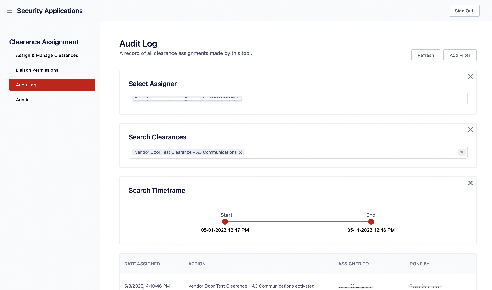

### Admin

View and manage users of the tool.

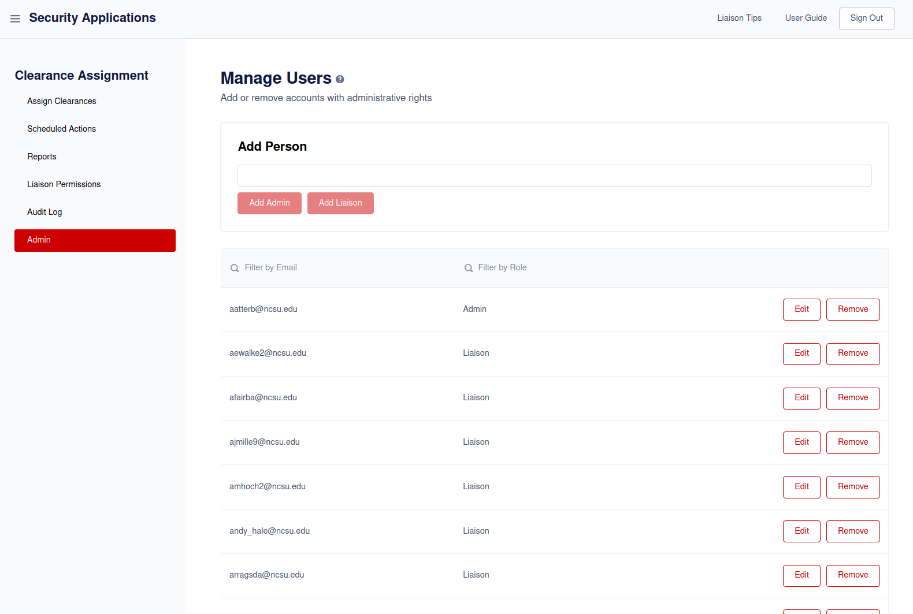

##### Liaison Users

- View clearances of any individual.
- Assign/Revoke certain allowed clearances of any individual.
- View future scheduled actions that they have made.
- View reports for their designated clearances.

##### Admin Users

- View clearances of any individual.
- Assign/Revoke any clearance of any individual.
- View all scheduled actions anyone has made.
- View reports for all clearances.
- View & manage the allowed clearances of any liaison.
- View a comprehensive log of every action made through the tool.
- View and manage the users who can use the tool.

#### Giving Someone Access

You can give someone access to the tool by searching for them in the people picker, then by clicking the role they need.

#### Removing Access

You can remove access from anyone by searching for them in the list and clicking Remove.

#### Editing Accesss

You can change a user's role by searching for them in the list, clicking Edit, and then picking the role they need.
