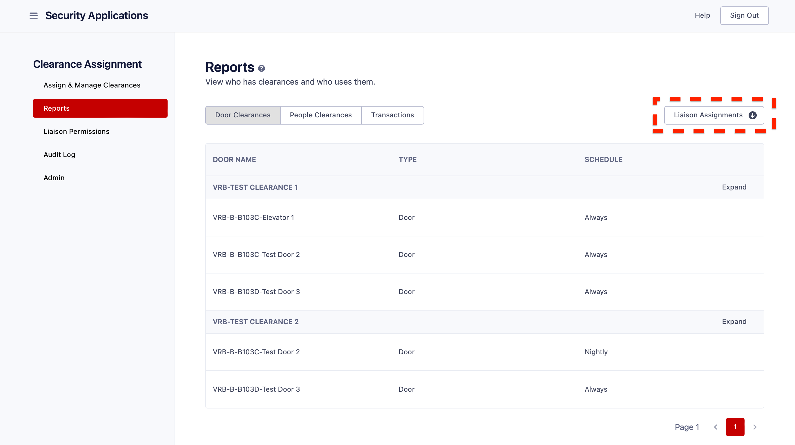

# Liaison

In comparison to the Admin role, the Liaison role has restricted privileges. This role enables individuals to have regulated access to view, assign, and revoke clearances. Additionally, the Liaison for a particular site can manage student access to a specific classroom or lab.

A user with the Liaison role can use these features:

- **Assign Clearances**: View, assign, or revoke clearances for users.
- **Scheduled Actions**: View any Scheduled Actions you've made.
- **Reports**: View clearances under your jurisdiction, the people who are assigned those clearances, doors included in those clearances, and any badge swipes to enter those areas.

&nbsp;

### Assign and Manage Clearances

#### Assignments & Revocations:

Type the UnityID or email address into the "Select Person" field and choose the desired person from the dropdown menu below. Once you have selected a "Person", a "Select Clearance" field will appear below it, followed by a list of the clearances that are available to the user. Please note that you have the option to select multiple users at this step.

After selecting a person, their clearances will be displayed below. You can choose to revoke any of those clearances immediately or to revoke a clearance at a later date.

Enter the desired clearance in the "Select Clearance" field, and then click on the appropriate option from the filtered list of available clearances. Please keep in mind that you can select multiple clearances, and all of them will be applied to the users selected in the previous step.

To complete the clearance assignment for the user/users, simply click on the "Assign" button. Once the clearance has been successfully assigned, it will appear in the list with a success message.

Optionally, you can schedule a clearance to be assigned on a future date by selecting "Assign Later" in the split button. When this option is selected, a date picker will appear, allowing for the selection of a date for the action to take place. Select the desired date, then click "Assign Later".

#### Bulk Actions:

You can make as many clearance assignments and revocations as you'd like in one step with Bulk Actions. With this, upload a CSV file with the assignments and revocations you'd like to make, and they will be done.

Click the `Bulk` button at the top of the page to upload a CSV file with as many action as you'd like. Click the `Download Template` button to see an example of a valid CSV file.

Upload a CSV file by dragging the file onto the arrow or by clicking `Browse`.

Review your actions, then click `Submit Actions`.

If there are errors in your file, you'll need to upload a different file with those errors resolved.

#### Notes On Each Row

- The Clearance Name is case-sensitive, must be an exact match, and must exist.
- The Action must be either "assign" or "revoke".
- The date must be in the ISO format. You can learn more about that format [here](https://www.digi.com/resources/documentation/digidocs/90001488-13/reference/r_iso_8601_date_format.htm).

&nbsp;

### Scheduled Actions

You can see any the status of any assignent or revocation that you scheduled. These are listed in cronological order, and you can filter these actions to narrow down the set of results.

You can see the status of each action - whether it is still pending for a future date, or whether or not it succeeded or failed. If an action failed, you can hover your cursor over the status icon of that row to see why it failed.

#### Cancelling a Scheduled Action

You can cancel any pending actions by selecting any actions you would like to cancel, then clicking the red "Cancel Scheduled Actions" button at the top right of the view. Only pending actions can be cancelled.

&nbsp;

### Reports

Reports are clear lists of information about the assignable clearances. Reports include doors for each clearance and persons assigned to each clearance

#### Door Clearances

Door Clearances include a list of all clearances in your jurisdiction to assign and the doors tied to those clearances. A list of those clearances is shown, paginated. Under each clearance, three or less doors will be shown. To view all doors, expand the clearance, and all doors will be shown for that clearance. Each door record includes the name of the door, whether or not it is a door or an elevator, and the schedule of the door.

#### People Clearances

All persons who have each clearance will be displayed for each clearance that is allowed to be assigned. Much like Door Clearances, a paginated list of all clearances is shown, and under each clearance, three or less persons will be displayed. Expand the clearance to view everyone who has that clearance. Each person includes a first name, last name, email address, and status. The report can optionally be filtered by person to view each clearance that person has.
